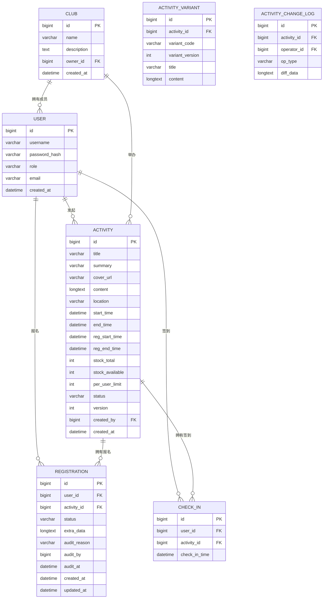

# Data Model & API Documentation (DMA)

## 1. 数据模型

### 1.1. ER 图



### 1.2. 数据库表结构

#### `users` (用户表)
| 字段 | 类型 | 约束 | 描述 |
| :--- | :--- | :--- | :--- |
| `id` | bigint | PK, auto_increment | 用户唯一ID |
| `username` | varchar(50) | NOT NULL, UNIQUE | 用户名/学号 |
| `password` | varchar(255) | NOT NULL | 加密后的密码 |
| `role` | varchar(20) | NOT NULL | 角色 (student, club_owner, counselor, admin) |
| `email` | varchar(100) | UNIQUE | 邮箱 |
| `created_at` | datetime | | 创建时间 |

#### `clubs` (社团表)
| 字段 | 类型 | 约束 | 描述 |
| :--- | :--- | :--- | :--- |
| `id` | bigint | PK, auto_increment | 社团唯一ID |
| `name` | varchar(100) | NOT NULL, UNIQUE | 社团名称 |
| `description` | text | | 社团描述 |
| `owner_id` | bigint | FK (users.id) | 社团负责人ID |
| `created_at` | datetime | | 创建时间 |

#### `act_activity` (活动表)
| 字段 | 类型 | 约束 | 描述 |
| :--- | :--- | :--- | :--- |
| `id` | bigint | PK, auto_increment | 活动唯一ID |
| `title` | varchar(255) | NOT NULL | 活动标题 |
| `summary` | varchar(500) | | 活动摘要 |
| `cover_url` | varchar(1024) | | 封面图链接 |
| `content` | longtext | | 活动详情 (HTML) |
| `location` | varchar(255) | | 地点 |
| `start_time` | datetime | | 活动开始时间 |
| `end_time` | datetime | | 活动结束时间 |
| `reg_start_time` | datetime | | 报名开始时间 |
| `reg_end_time` | datetime | | 报名结束时间 |
| `stock_total` | int | | 总名额 |
| `stock_available` | int | | 剩余名额 |
| `status` | varchar(20) | NOT NULL | 状态 (DRAFT, PENDING_REVIEW, APPROVED, ONLINE, REJECTED, OFFLINE) |
| `created_by` | bigint | FK (users.id) | 创建者ID |
| `version` | int | | 乐观锁版本号 |

#### `act_activity_variant` (活动变体表)
| 字段 | 类型 | 约束 | 描述 |
| :--- | :--- | :--- | :--- |
| `id` | bigint | PK, auto_increment | 变体ID |
| `activity_id` | bigint | FK | 活动主表ID |
| `variant_code` | varchar(10) | | 变体代码 (如 A/B) |
| `variant_version` | int | | 变体版本号 |
| `title` | varchar(255) | | 变体标题 |
| `content` | longtext | | 变体详情 |

#### `act_activity_change_log` (操作日志表)
| 字段 | 类型 | 约束 | 描述 |
| :--- | :--- | :--- | :--- |
| `id` | bigint | PK, auto_increment | 日志ID |
| `activity_id` | bigint | FK | 活动ID |
| `operator_id` | bigint | FK | 操作人ID |
| `op_type` | varchar(50) | | 操作类型 |
| `diff_data` | longtext | | 变更详情 (JSON) |

#### `registrations` (报名表)
| 字段 | 类型 | 约束 | 描述 |
| :--- | :--- | :--- | :--- |
| `id` | bigint | PK, auto_increment | 报名记录ID |
| `user_id` | bigint | FK (users.id) | 用户ID |
| `activity_id` | bigint | FK (activities.id) | 活动ID |
| `status` | varchar(20) | NOT NULL | 状态 (PENDING, APPROVED, REJECTED, CANCELED, COMPLETED) |
| `extra_data` | longtext | | 报名附加信息 (JSON) |
| `audit_reason` | varchar(500) | | 审核/驳回原因 |
| `audit_by` | bigint | | 审核人ID |
| `audit_at` | datetime | | 审核时间 |
| `created_at` | datetime | | 报名时间 |
| `updated_at` | datetime | | 更新时间 |

#### `check_ins` (签到表)
| 字段 | 类型 | 约束 | 描述 |
| :--- | :--- | :--- | :--- |
| `id` | bigint | PK, auto_increment | 签到记录ID |
| `user_id` | bigint | FK (users.id) | 用户ID |
| `activity_id` | bigint | FK (activities.id) | 活动ID |
| `check_in_time` | datetime | | 签到时间 |

## 2. API 接口设计

### 2.1. 通用约定
- **Base URL**: `/api/v1`
- **认证**: 基于 JWT (JSON Web Token) 的 Bearer Token 认证。
- **通用成功响应**:
  ```json
  {
    "code": 200,
    "message": "Success",
    "data": { ... } 
  }
  ```
- **通用失败响应**:
  ```json
  {
    "code": [错误码],
    "message": "[错误信息]",
    "data": null
  }
  ```

### 2.2. 核心接口

#### 活动管理 (Admin Activity)
- `GET /admin/activities`: 获取活动列表（支持分页、关键字搜索、状态筛选、创建人过滤）
- `GET /admin/activities/{id}`: 获取指定活动详情（包含审核状态等内部信息）
- `POST /admin/activities`: 创建新活动草稿
- `PUT /admin/activities/{id}`: 更新活动信息（仅限 DRAFT/REJECTED/OFFLINE 状态）
- `DELETE /admin/activities/{id}`: 逻辑删除活动
- `POST /admin/activities/{id}/submit-review`: 提交审核
- `POST /admin/activities/{id}/withdraw`: 撤回审核
- `POST /admin/activities/{id}/approve`: 审核通过（支持设置定时发布/下线时间）
- `POST /admin/activities/{id}/reject`: 审核驳回
- `POST /admin/activities/{id}/offline`: 手动下线活动
- `GET /admin/activities/{id}/change-logs`: 获取操作日志列表
- `POST /admin/activities/{id}/rollback/{logId}`: 回滚到指定版本

#### 文件上传 (File)
- `POST /admin/files/upload`: 上传图片/附件，返回文件访问路径

#### 报名 (Registration)
- `POST /registrations`: 学生一键报名（扣减名额、重复报名拦截）
- `POST /registrations/{id}/cancel`: 学生取消报名（回补名额）
- `GET /registrations/my`: 学生查看我的报名记录（支持状态筛选）
- `GET /registrations/{id}`: 查看报名详情（仅本人或有权限的管理者可见）
- `GET /admin/registrations`: 管理端查看某活动报名名单（权限: club_owner, counselor, super_admin）
- `POST /admin/registrations/{id}/audit`: 审核报名（通过/驳回，可填写原因）（权限: club_owner, counselor, super_admin）
- `GET /admin/registrations/stats`: 管理端统计面板（权限: club_owner, counselor, super_admin）

#### 签到 (Check-in)
- `POST /check-in/qrcode`: (负责人)发起签到，获取动态二维码内容 (权限: club_owner, admin)
- `POST /check-in`: (学生)扫码签到

#### 用户 (User)
- `POST /auth/register`: 用户注册
- `POST /auth/login`: 用户登录，返回 JWT
- `GET /users/me`: 获取当前用户信息
