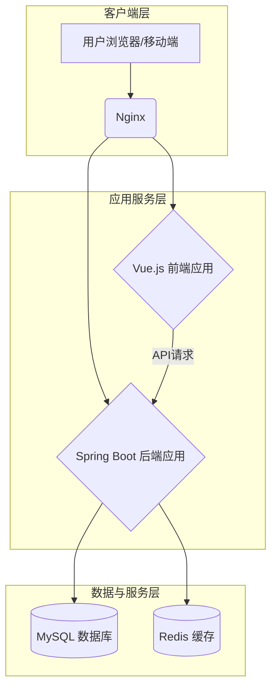

# Technical Specification Document (TSD)

## 1. 系统架构

### 1.1. 架构概述
本系统采用业界成熟的**前后端分离**架构模式。前端使用 Vue.js 框架构建单页应用 (SPA)，负责用户界面和交互逻辑；后端使用 Spring Boot 框架提供 RESTful API 接口，负责业务逻辑处理、数据持久化和外部服务集成。这种架构模式有助于实现前后端并行开发、独立部署，并提升系统的可维护性和扩展性。

### 1.2. 系统架构图

### 1.3. 组件分解
- **前端 (Client)**: 基于 Vue 3 + Vue Router + Pinia + Axios + Element Plus 构建，负责视图渲染、路由管理、状态管理和 API 请求。
- **后端 (Backend)**: 基于 Spring Boot + Spring MVC + MyBatis-Plus + Spring Security 构建，提供核心业务 API，并负责用户认证、权限控制和数据访问。
- **数据库 (Database)**: 使用 MySQL 8.0 作为主数据库，存储所有业务核心数据。
- **缓存 (Cache)**: 使用 Redis 缓存热点数据（如用户信息、热门活动）和管理分布式 Session，以提升性能和系统响应速度。
- **Web服务器 (Web Server)**: 使用 Nginx 作为反向代理和静态资源服务器，负责请求分发和负载均衡。

## 2. 技术栈选型

| 领域 | 技术 | 版本 | 选型理由 |
| :--- | :--- | :--- | :--- |
| **前端框架** | Vue.js | 3.x | 渐进式框架，上手快，生态丰富，性能优越。 |
| **UI 库** | Element Plus | 最新版 | 专为 Vue 3 设计的企业级 UI 组件库，美观且功能强大。 |
| **后端框架** | Spring Boot | 2.7.x | Java 生态事实标准，快速开发，社区活跃，稳定可靠。 |
| **数据持久化** | MyBatis-Plus | 最新版 | 在 MyBatis 基础上增强，简化 CRUD 操作，提高开发效率。 |
| **安全框架** | Spring Security | 集成版 | 提供全面的认证和授权解决方案，与 Spring 无缝集成。 |
| **数据库** | MySQL | 8.0+ | 开源、稳定、社区支持广泛的关系型数据库。 |
| **缓存** | Redis | 8.x+ | 高性能的内存键值数据库，适用于缓存、会话管理等多种场景。 |
| **构建工具** | Maven | 3.8+ | Java 项目标准构建工具，管理项目依赖。 |
| **构建工具** | Vite | 最新版 | 新一代前端构建工具，提供极速的冷启动和热更新。 |

## 3. 关键设计决策

### 3.1. 动态二维码签到机制
- **问题**: 如何保证签到的可靠性，防止截图代签等作弊行为？
- **决策**: 采用**基于时间戳和签到会话ID的动态二维码**方案。
- **实现**: 
  1. 负责人发起签到时，后端创建一个有时效性（如 60 秒）的签到会话，并生成唯一ID。
  2. 后端将该会话ID和当前时间戳加密生成一个 token，并返回给前端生成二维码。
  3. 前端通过轮询或 WebSocket，每隔一定时间（如 50 秒）从后端获取新的 token 来刷新二维码。
  4. 学生扫码时，后端解码 token，验证其时效性和会话ID的有效性，完成签到，并标记该用户在该会话下已签到（幂等性保证）。

### 3.2. 高并发报名处理
- **问题**: 热门活动开放报名瞬间，可能引发高并发请求，导致数据库压力过大甚至服务崩溃。
- **决策**: 采用**Redis缓存 + 消息队列 (MQ)** 的异步削峰方案。
- **实现**: 
  1. 活动库存（可报名人数）提前加载到 Redis 中。
  2. 用户点击报名时，请求首先访问 Redis，利用其原子操作 `DECR` 预减库存。
  3. 若预减成功，则表示抢到名额，后端将报名请求（包含用户ID和活动ID）发送到消息队列后立即返回成功响应给用户。
  4. 后端消费者服务从消息队列中拉取请求，异步地将报名记录持久化到 MySQL 数据库。
  5. 若 Redis 库存不足，则直接拒绝请求，避免冲击数据库。

### 3.3. RBAC 权限模型
- **问题**: 系统涉及多种角色（学生、社团负责人、辅导员、管理员），如何精细化管理其权限？
- **决策**: 基于角色的访问控制（RBAC），使用 **用户-角色-权限** 模型。
- **实现**: 
  1. **权限 (Permission)**: 定义原子操作，如 `activity:create`, `activity:delete`, `registration:approve`。
  2. **角色 (Role)**: 聚合一组权限，如“社团负责人”角色拥有 `activity:create`, `registration:approve` 等权限。
  3. **用户 (User)**: 分配一个或多个角色。
  4. 使用 Spring Security 的注解（如 `@PreAuthorize`）或拦截器，在 API 接口层面对用户请求进行权限校验。

## 4. 部署架构

- **环境**: 至少包含开发 (dev)、测试 (test)、生产 (prod) 三套环境。
- **部署方式**: 推荐使用 Docker 进行容器化部署，并通过 Docker Compose 或 Kubernetes (K8s) 进行服务编排和管理，以实现环境一致性和快速扩缩容。
- **CI/CD**: 搭建 Jenkins 或使用 GitHub Actions 等工具，实现代码提交后自动化的构建、测试和部署流水线。
